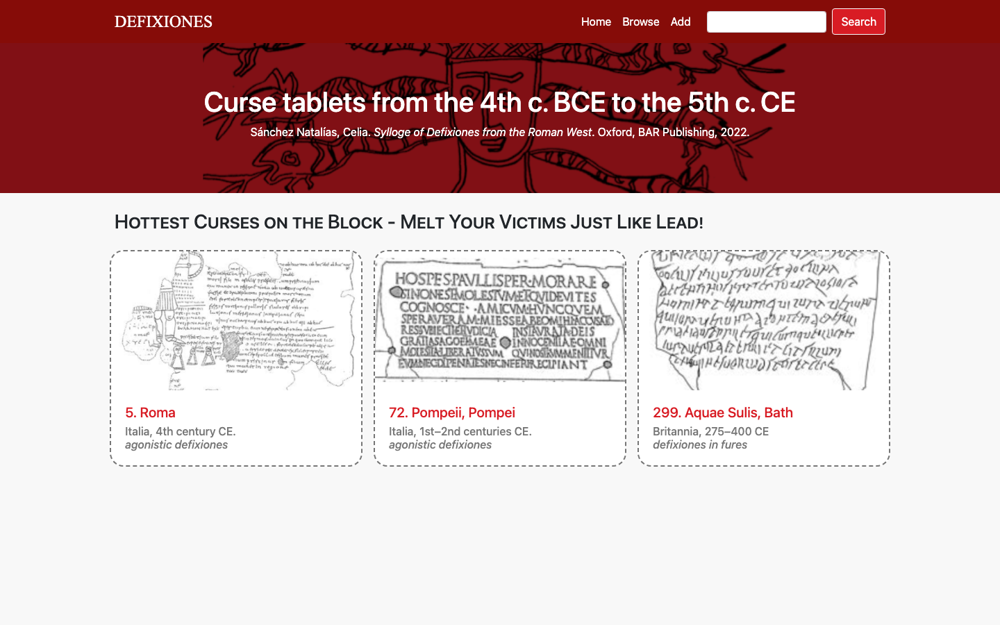
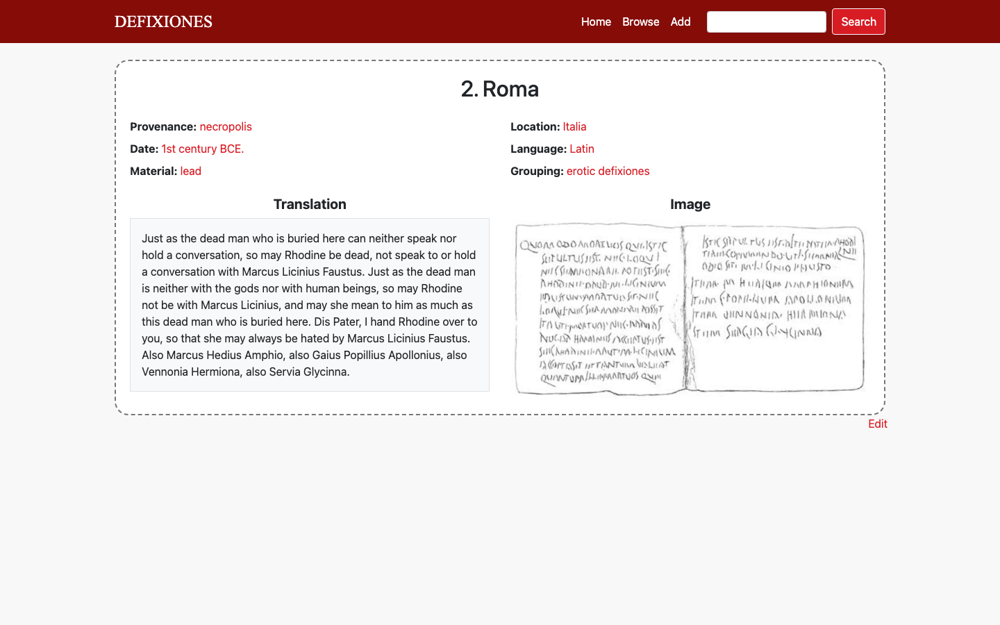
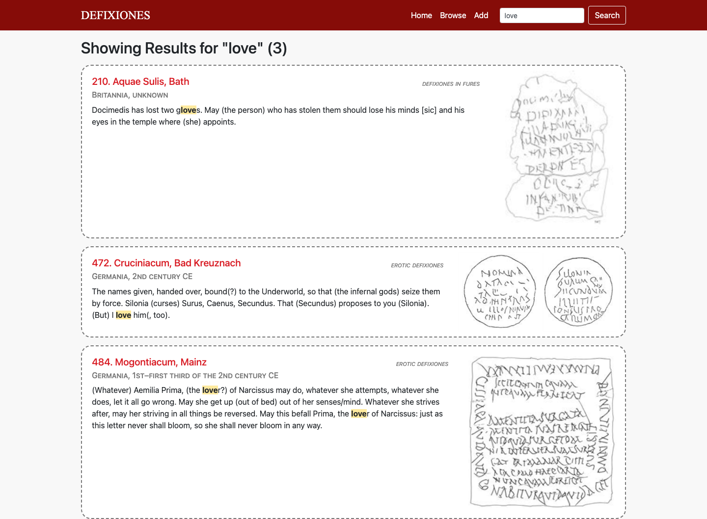
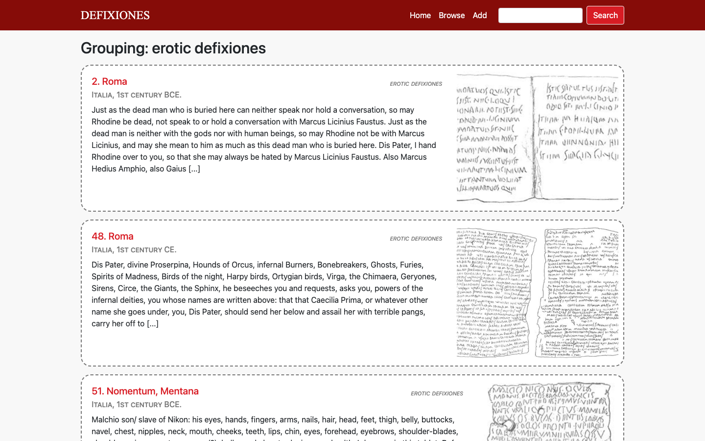
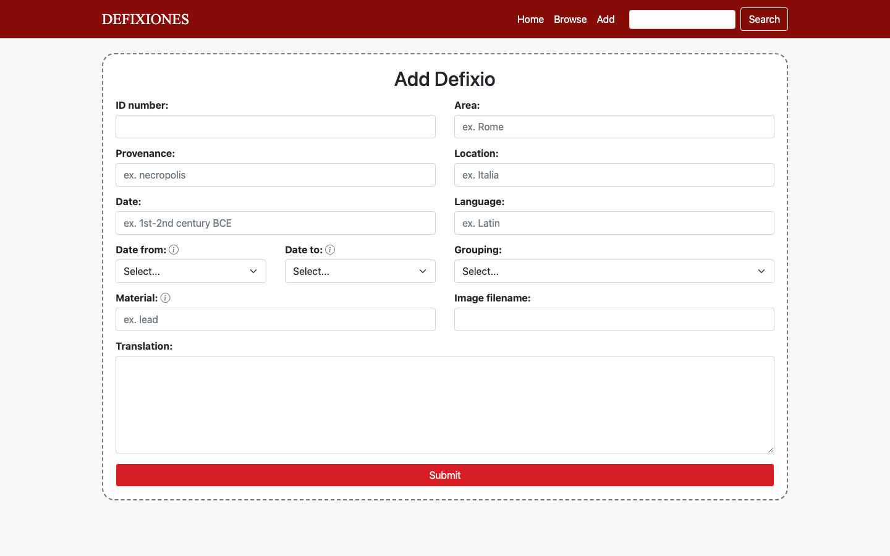

# DefixioDatabase

A mock database website for *defixiones* (curse tablets) — inscribed lead sheets used across the ancient Greek and Roman world to bind rivals in love, sport, law, and business to a curse. This project catalogues 31 published tablets and makes them browsable, searchable, and filterable through a small Flask app.

Data adapted from Sánchez Natalías, Celia. *Sylloge of Defixiones from the Roman West.* Oxford: BAR Publishing, 2022.

## Features

- **Browse** the full catalogue, or a featured subset on the home page
- **Detail pages** per tablet with provenance, location, date, material, language, curse category, translation, and a facsimile image
- **Full-text search** across provenance, location, date, grouping, and translation, with matched terms highlighted and long translations truncated around the match
- **Filter by any attribute** (material, language, area, curse category, or date range) via a generic `/<key>/<value>` route
- **Add / edit entries** through a validated form (unique ID enforcement, numeric date-range checks, comma-separated materials)

| Detail view | Search results |
|---|---|
|  |  |

| Filtered by category | Add entry form |
|---|---|
|  |  |

## Stack

- **Flask** + **Jinja2** for routing and templating
- Catalogue entries stored in-memory as a Python dict (`data.py`), keyed by tablet ID
- Vanilla **JavaScript** (`static/add.js`, `edit.js`, `index.js`, `search.js`) for client-side form handling
- Hand-built CSS theme (`static/main.css`)

## Routes

| Route | Description |
|---|---|
| `/` | Home page with featured tablets |
| `/browse_all` | Full catalogue listing |
| `/defix/<id>` | Detail page for a single tablet |
| `/search` | Full-text search (GET/POST) |
| `/<key>/<value>` | Filter by attribute (e.g. `/material/lead`, `/date_val/1,2`) |
| `/add` | Add a new tablet (form) |
| `/add_item` | Add a new tablet (POST endpoint) |
| `/edit/<id>` | Edit an existing tablet (form) |
| `/edit_item/<id>` | Edit an existing tablet (POST endpoint) |
