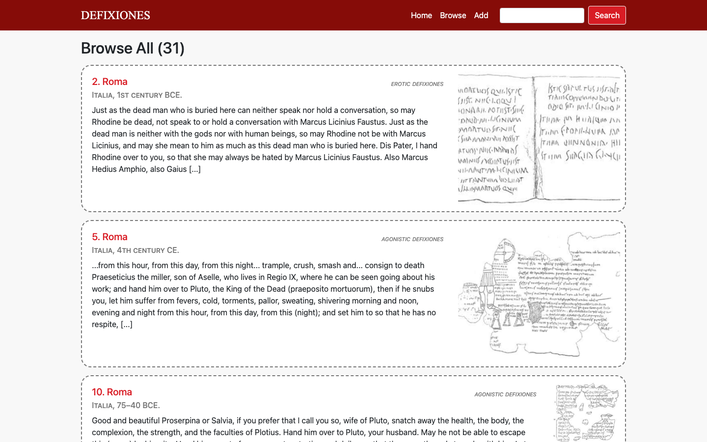

# ⚱️ Defixiones

### A (fake) digital catalogue of ancient Roman & Greek curse tablets

Browse, search, filter, and contribute entries from a scholarly corpus spanning the 4th century BCE to the 5th century CE.

 

## About the project

*Defixiones* (Latin for "curse tablets") were inscribed sheets of lead used across the Greek and Roman world to bind rivals in love, sport, law, and business to a curse. This project collects 31 published tablets into a browsable, searchable web database — built end-to-end with a Flask backend, Jinja2-rendered templates, and vanilla JS for dynamic filtering and search-term highlighting.

> Data sourced from Sánchez Natalías, Celia. *Sylloge of Defixiones from the Roman West.* Oxford: BAR Publishing, 2022.

The app supports full CRUD-style interaction: visitors can browse tablets by era, material, language, or curse type; search full translations with live highlighting; and add or edit catalogue entries through validated forms.

<table align="center">
  <tr>
    <td align="center"><h3>31</h3>catalogued tablets</td>
    <td align="center"><h3>9</h3>centuries covered</td>
    <td align="center"><h3>4</h3>curse categories</td>
    <td align="center"><h3>7</h3>Flask routes</td>
  </tr>
</table>

## Walkthrough

### 🏛️ Home — featured tablets
`/`

A custom red-and-parchment theme (matching the "inscribed lead" motif) greets visitors with a rotating set of featured tablets, each linking through to its full record.

### 📜 Detail pages
`/defix/<id>`

Every tablet gets its own route rendering provenance, location, date, material, language, and grouping — each value itself a clickable filter — alongside the full translation and a drawn facsimile of the inscription.

| Detail view — Tablet #2, Roma | Full-text search — "love" |
|---|---|
|  |  |

### 🔍 Highlighted full-text search
`/search`

Search runs across provenance, location, date, grouping, and translation text. Matches are highlighted in place, and long translations are intelligently truncated around the first match rather than just at the start.

### 🏷️ Filter by any attribute
`/<key>/<value>`

A single generic `/<key>/<value>` route powers filtering by material, language, area, curse category, or date range — including compound date-range queries resolved against each entry's date span.

| Filtered by grouping — "erotic defixiones" | Add / edit form |
|---|---|
|  |  |

### 📚 Browse the full corpus
`/browse_all`

The complete catalogue in one scrollable list — provenance, era, curse type, translation excerpt, and facsimile for every tablet, letting researchers scan the whole collection at a glance.

### ✍️ Validated contribution form
`/add`

New entries are added through a form with server-side validation — unique ID enforcement, numeric date-range checks, and comma-separated material parsing — backed by an identical edit flow for existing records.

## Under the hood

A lightweight, dependency-free stack — no database engine, no frontend framework.

| | |
|---|---|
| **Flask + Jinja2** | Server-side routing and templating for every page, including a shared layout and reusable filtered/results partials. |
| **In-memory data store** | Catalogue entries live in a Python dict (`data.py`), keyed by tablet ID — swappable for a real database later. |
| **Generic filter routing** | One `/<key>/<value>` endpoint handles every facet (material, language, date range, grouping) via introspection over entry keys. |
| **Vanilla JS forms** | `add.js` / `edit.js` handle client-side interactions and POST JSON to Flask endpoints for validation. |
| **Regex-based highlighting** | Search matches are wrapped server-side with `re.sub`, including a custom truncation routine that centers excerpts on the match. |
| **Custom CSS theme** | A hand-built red/parchment palette and dashed "inscribed tablet" card style tie the visual design to the subject matter. |

## Routes

| Route | Description |
|---|---|
| `/` | Home page with featured tablets |
| `/browse_all` | Full catalogue listing |
| `/defix/<id>` | Detail page for a single tablet |
| `/search` | Full-text search (GET/POST) |
| `/<key>/<value>` | Filter by attribute (e.g. `/material/lead`, `/date_val/1,2`) |
| `/add` | Add a new tablet (form) |
| `/add_item` | Add a new tablet (POST endpoint) |
| `/edit/<id>` | Edit an existing tablet (form) |
| `/edit_item/<id>` | Edit an existing tablet (POST endpoint) |